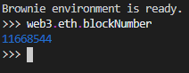
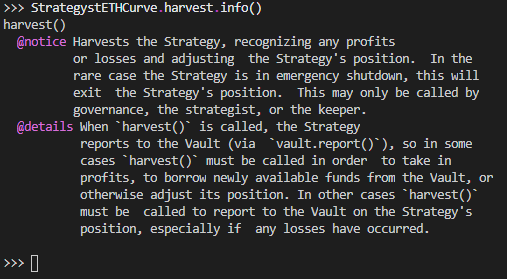
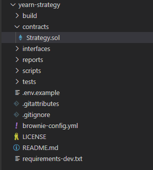

# Overview
I've been reading a lot of smart contracts lately, but until now haven't spent any time writing them. Recently I've gotten into contact with the strategists at Yearn and am going to try my hand at adapting some v1 vault strategies over to v2. 

## Setting up Dev Environment for Yearn Strategies
The yearn team has a [Yearn-Vaults](https://github.com/iearn-finance/yearn-vaults) repo on Github which offers some guidance for getting up and running with the all the basic contracts for Yearn vaults:
- `BaseStrategy.sol` - the base strategy template with current version of the strategy API methods to be overwriten.
- `Registry.vy` - the Yearn contract registry which manages the Yearn product list and deployment of new vaults.
- `Vault.vy` - the base vault contract which each new vault will proxy off of when created when the [*.newVault()*](https://github.com/iearn-finance/yearn-vaults/blob/00d880131d027219c1a4d61d0e4f01bbe627c02d/contracts/Registry.vy#L191) method is called on the registry.


Python Virtualenv is a software tool that offers two main benefits:

Isolation of package installations: you can use different package sets for each project.
Isolation of python versions: you can use different python versions (v2, or v3) for each project.

In the world of Python, where many projects are written in v2 and others in v3, it is importants to be able to run each project in it's native version and keep the packages separate.

## Getting Brownie up and Running:  
### What is Brownie? 
>Brownie is a Python-based development and testing framework for smart contracts targeting the Ethereum Virtual Machine  

It has [ganache-cli](https://github.com/trufflesuite/ganache-cli) (a nodejs package) as a dependency which provides the "personal blockchain"-like features for Brownie to work upon. With Ganache-cli providing Brownie a simulated full node behavior, it makes developing and testing Ethereum apps far easier.  

### Installing Brownie
Instructions for installing Brownie are located [here](https://eth-brownie.readthedocs.io/en/stable/install.html). But first you'll want to make sure you have Python and pip/pipx installed as well as Ganache-CLI (install guide [here](https://github.com/trufflesuite/ganache-cli)).


## Using Brownie to Fork Mainnet
Brownie has several killer features. One of them is the ability to fork mainnet at some given block. This feature allows us to produce a snapshot of the currnet mainnet chain upon which we can test our contracts and scripts. On the backend, Brownie will need to be pointed to either a local node or a remote service (e.g. Infura). To do this, open up your terminal and enter the following command to open up the brownie console on a forked mainnet.
```
brownie console --network mainnet-fork
```
You can now run some commands against a mainnet fork. Let's try it...  
  
First, let me go ahead prove that this is a static copy of mainnet by checking the current block number at Etherscan.io against the block number that Brownie has snapshotted for use.  
Etherscan shows a current block = `11668559`.  
Now to check our snapshot's block, we can run the following web3 command: 
```
web3.eth.blockNumber
```
Which gives me the following result:  
  
  

Here we see the block number of our snapshot is at `11668544`, which as expected, is behind the real mainnet block, proving that our snapshot of a past point in time worked. We can now use this snapshot as a test area for our code and contracts.  

### Some other Brownie Cool-ness  

Now Let's try to query a real-life contract from mainnet using this fork we've created. The following lines will query a Chainlink contract which outputs the current price of Ethereum.  


ethPriceContractAddress = "0xf79d6afbb6da890132f9d7c355e3015f15f3406f"
oracle = Contract.from_explorer(ethPriceContractAddress)
oracle.latestAnswer()  
  

You might ask how we pulled this off this `.latestAnswer()` method call by name without an ABI. The answer lies within the second line where we run a little Brownie magic:  


Contract.from_explorer(address, as_proxy_for=None, owner=None)
  

[Contract.from_explorer](https://eth-brownie.readthedocs.io/en/stable/api-network.html#Contract.from_explorer) is a built-in Brownie function which grabs the ABI from Etherscan and applies it to our contract instance `oracle`. Of course this is only possible when the ABI is available in Etherscan.
  
Shall we see another cool Brownie trick? How could would it be to explore the documented input and return parameters for a method? Well, for any Etherscan-verified contract that implements [NatSpec Format](https://docs.soliditylang.org/en/latest/natspec-format.html), we can do this with a quick command. Let's try this on the following Yearn vault strategy: `StrategystETHCurve`:  


StrategystETHCurve = Contract.from_explorer("0xCa8C5e51e235EF1018B2488e4e78e9205064D736")
StrategystETHCurve.harvest.info()
  
  

Which gives the following result:  
  


Here we are exploring the developer documentation for the `.harvest()`, method, but we can actually replace that with any other method inside this contract, or even on the contract itself to return the docs.

## Initializing a Project with Brownie 
Now that we have a basic feel for what Brownie can do, let's `exit()` the console and then use a different Brownie command to initialize a project workspace and then deploy a sample smart contract. Since I'm intending to work on a Yearn strategy soon, I want to pull in their strategist's template which I can do with the following command:
```
brownie bake yearn-strategy
```
Now, you should see a project structure appear in your working directory. Whoa! Pretty neat!  


  
Just like popular package managers (e.g. `pip` or `npm`), we can use Brownie to fetch a repository, or as they call them "Brownie mixes". This generates a barebones project area (base on the default Truffle workspace) for us to do some development and testing.  
Aside from Yearn, you can find many more Brownie mixes made available from different projects at [this link](https://github.com/brownie-mix).

## Compiling our first Contract
Now that we have a project setup, let's go to the command line and run:  
```
brownie compile
```
This will pull in all dependencies and compile our contract code for us. It should be successful if no breaking changes were made to the default contract. `Strategy.sol` is a sample strategy which pulls in `BaseStrategy` and `StrategyParams` dependencies from Yearn and can be modified build your own custom strategy against the Yearn standard API.