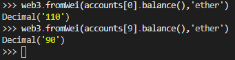

# Overview
In [my last blog post](https://theryanmiller.com/setting-up-smart-contract-development-environment.html), I walked through what Brownie is, installation, and a basic compilation of a smart contract. In this post, we'll go a few steps further and learn about all the basics needed for deploying and testing a smart contract with actual transactions after deployment.  
We'll spend some time learning about:
- Account creation and management
- Deployment scripts
- Deployment of a sample Brownie mix
- Deployment of a custom smart contract with DeFi integration 

## Requirements
To properly follow along with this post yourself:
- Make sure you've read the [first post] in this series and have installed all the pre-requisites(./setting-up-smart-contract-development-environment.html) in this series.
- Install the sample Brownie mix called "[token]([token](https://github.com/brownie-mix/token-mix))" with `brownie bake token`

# Accounts
All interactions on the Ethereum blockchain require interaction with accounts - there's simply no way around it. Luckily Brownie (using Ganache-cli under the hood) gives us plenty of ability to generate and manage accounts, fund them with Ether to create transactions, and use them for our testing. We'll use the following command to generate a new set of 10 accounts with keys placed in a local json keystore located at `~/.brownie/accounts/dev.json` by default.
```
brownie accounts generate dev
```
In this scenario, we use `dev` as the account alias because it is used in the default scripts provided by the Yearn Strategy Brownie Mix I'm using. But really, the alias can be set to anything (just know it will be used to name the file in the Brownie accounts directory).
After issuing this command, input a passphrase that will be used to unlock the keystore. A recovery mnemonic will be generated to keep if recovery is needed for any reason.  
 
With the Brownie console up, we can now type
```
accounts
```
to get a full list of account addresses. We can specify the first account address like this, 
```
accounts[0]
```
And we can also check it's balance from the console like this:

accounts[0].balance() // for balance in Wei
web3.fromWei(accounts[1].balance(),'ether') // for balance in Ether
  

Upon initialization, all test accounts are seeded with 100 Ether, so the results of your commands should match what I have here.


For a final exercise, let's try transfering ETH from one account to another using this command:

accounts[9].transfer(accounts[0], "10 ether")
    

You should see a transaction confirmed line with a hash. Now let's check the resulting balances, using these two lines of code: 


accounts[0] + web3.fromWei(accounts[0].balance(),'ether')
accounts[9] + web3.fromWei(accounts[9].balance(),'ether')
  
 
If all went well, we should see these results which show 10 Ether gained by account 0, and 10 Ether reduced at account 9.  



That's it on accounts for now. More information can be found [here](https://eth-brownie.readthedocs.io/en/stable/account-management.html).

# Deployment Scripts
Deployment scripts are a simple, and efficient way to interact with your contracts and chain snapshot using Brownie. Scripts are extremely useful for deployment of contracts (to mainnet or testnet) and for automating processes.  
With Brownie, scripts must be stored in the `scripts/` directory. You can run scripts in two ways:  
- From your shell with `brownie run <script>`
- From console with `>>> run('script')`

Let's try a simple one. If you haven't already, install the Brownie mix called `token` which is one of the most basic mixes (templates) offer by default from the team who made Brownie.  

```
brownie bake token
```
This will create a new working directory with all the project files we need in the proper project structure. Go ahead and open the new `token` directory in your IDE, and take notice at the directory structure, which will be common for all mixes.

Let's go ahead and open the `token.py` script from the scripts directory. You'll find this most basic deployment script in there:

#!/usr/bin/python3

from brownie import Token, accounts
def main():
    return Token.deploy("Test Token", "TST", 18, 1e21, {'from': accounts[0]})
  

The import statements at the top are important. This is where the script pulls in the Token contract bytecode and the accounts which will be used to deploy it. In the main method, the deployment transaction is sent along with the contracts constructor parameters needed to initalize it. 

## Compiling And Deploying Smart Contracts
Before we can run this deployment script, we need compile any smart contracts Solidity code we have, which basically puts it into a form that can be deployed to the Etherem blockchain. We can compile with the command:

```
brownie compile
```  

Next, we want to deploy the smart contract with the deployment script we just discussed. To do so, issue this command:  


brownie run token.py
  

You should end up with a successful transaction that looks like this:


Brownie saves information about contract deployments on live networks. Once a contract has been deployed, the generated `ProjectContract` instance will still be available in future Brownie sessions via the `./build/deployments/map.json` file as long as you're working from a persisted test environment. More information on deploying with Brownie is [here](https://eth-brownie.readthedocs.io/en/v1.3.0/deploy.html).

## Interacting with Deployed Smart Contracts
There are two basic ways to interact with the blockchain. One of the simplest ways is to read it. Why? Because it doesn't involve a transaction, which always costs Ether. Let's practice sending a call to read our contract.

### Read Calls
To send a call to read data from our deployed contract on the blockchain, we can use the `.balanceOf()` method in our contract like so:

Token[0].balanceOf(accounts[2], {'from': accounts[0]})
   
  
This will return to us the TST token balance of the account at index number 2 in our account list. This should return 0, because the entire token balance was minted to the account which created the token upon contract creation. Note that the final parameter in our call `{'from': accounts[0]}` is purely optional, since no account is needed for non-transaction calls.

  

Clearly since we haven't transferred any tokens to that account yet, it returns zero. Let's go ahead an send a state change transaction to get some tokens issued to that account, and then check the balance again.


### State Change Transactions
To transfer tokens over to that account, we can use the `.transfer()` method found in our contract like this:
  

Token[0].transfer(accounts[2], 1e18, {'from': accounts[0]})
 

This transfers 1 token (1e18, takes care of the 18 decimals) and sends it to our account at index number 2. We can verify this worked by running the same command from above:


Token[0].balanceOf(accounts[2])
   

This time the result is 1e18, or just 1 token. (If we want convert this vaulue to tokens, we can wrap the call in web3 to convert fromWei to Ether).

# Creating a contract that interacts with Uniswap  
Now, for a neat trick, let's create a contract that interfaces with another protocol, Uniswap.
I've written [this smart contract](https://gist.github.com/TheRyanMiller/add5b79f2209b8f2be5321a27600f1f0) which you can copy and paste into a new file called `UniBless.sol`. The purpose of this contract is to send Ether to Uniswap and send wBTC to one "lucky" person (but, for now this target address is actually hardcoded). Yes, it is a silly contract, but I wanted to make it just to demonstrate an integration - and Uniswap is a very popular DeFi API.

To get everything working we'll need to follow these steps:
- Grab [UniBless.sol](https://gist.github.com/TheRyanMiller/add5b79f2209b8f2be5321a27600f1f0) and place it into your contracts directory  
- Grab [uniswap.sol](https://gist.github.com/TheRyanMiller/0a49042fd923f6357a060c0b01064839) and place it in your `interfaces/` directory  
- Add a new script called `uniBless.py` to your `scripts/` directory that looks like this:  


#!/usr/bin/python3

from brownie import UniBless, accounts

def main():
    return UniBless.deploy({'from': accounts[0]})


- Compile new contracts with `brownie compile`
- Run `brownie console --network mainnet-fork` to fire up a new snapshot
- From the console, run the deploy script with `run('uniBless')` to deploy the contract
- Run the following command to send 1 ETH from account 2.

UniBless[0].bless({"from": accounts[2], "value": 1e18})


Awesome! First transaction successfully sent to our contract. Now, let's try checking the target account's wBTC balance to make sure it arrived. First, we'll need to fetch the ABI for wBTC. We can do that with this quick command:
```
wbtc = Contract.from_explorer("0x2260FAC5E5542a773Aa44fBCfeDf7C193bc2C599")
```
Now to check the balance of the target address we can run the `.balanceOf()` method of the wbtc contract we just pulled, like this:
```
wbtc.balanceOf("0x33A4622B82D4c04a53e170c638B944ce27cffce3")
```
And there we have it! We've now deployed two contracts, and interacted with them all on a local fork of mainnet!