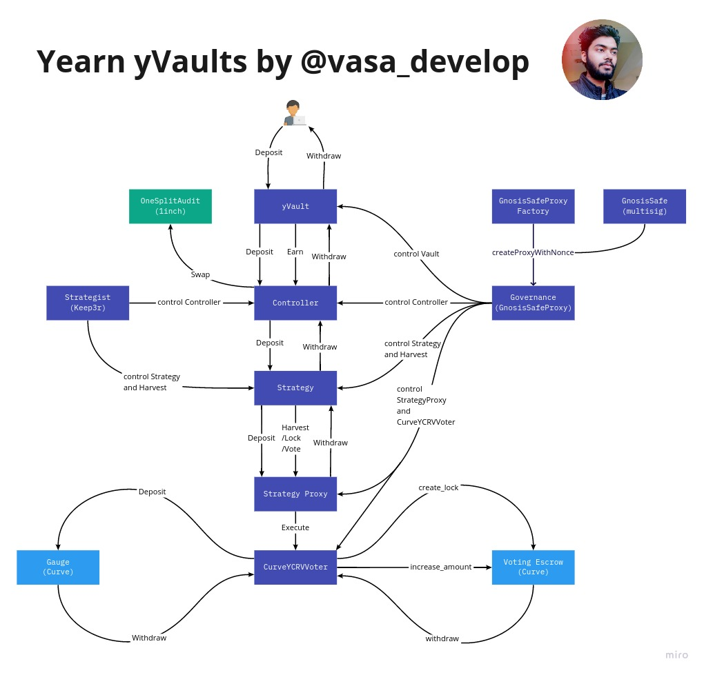

# Yearn
Yearn.Finance is a system of DeFi protocols on Ethereum that offers a number of passive investment products to users. Known to have some of the sharpest minds in all of DeFi, Yearn version 1 began as an automated way for users to pool like stablecoins together (e.g. DAI) and then have the pool move to top-yielding lending protocol in an automated way. While Yearn version 1 great product still today, the complexity of the DeFi ecosystem has significantly advanced with the rise of "yield-farming" and "incentivized pools".  
Andre and Yearn introduced a new product called "Vaults" to capitalize on this new paradigm. 

## Overview - What are Vaults
With Vaults, Yearn has introducd the concept of "Strategies" which are contract-encoded processes which target yield farming opportunities and optimize the value extraction. Money deposited into the vault contract moves to the strategy contract to be "put to work".

## Underlying

## Vaults - How is balance calculated

Underlying x Price per share.
The vault implements the ERC20 yTokens contract while the strategy holds the balance of the underlying token.

## Fees
Current withdrawals are subject to 0.5% withdrawal fee. 
5% performance fee on subsidized gas (only applied to delegated vaults on rebalace).

## Resources

[Yearn Deployed Contracts Registry](https://andrecronje.gitbook.io/yearn-finance/developers/deployed-contracts-registry)
[Harvesting Thread](https://www.reddit.com/r/yearn_finance/comments/ipj7py/school_me_on_harvesting_a_yearn_vault_contract/)
[Vasa - twitter diagrams](https://twitter.com/vasa_develop)
