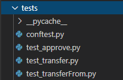

# Overview
This post is the 3rd in a three part series for getting started with Brownie. We've covered installation, project creation, and deployments with basic testing from the console. But now we're going to level up the testing to make sure we know exactly how our contract is behaving, and what is happening.

## Local Node vs Infura
If you have a local or networked Geth node, you might see some nice performance gains over using the default Infura.
To configure usage of a local Geth node, you have two options. 

1. Run the following command from the terminal, replacing IP addresses and ports where necessary (where `host` and `port` is where you want the fork to be served from, and `fork` is the local or remote node running Geth):
```
brownie networks add development geth-node host="http://127.0.0.1" name="Ganache-CLI (Geth Mainnet Fork)" cmd="ganache-cli" explorer="https://api.etherscan.io/api" port=8545 gas_limit=10000000 mnemonic="brownie" fork="http://192.168.1.100:8545"
```
Or, alternatively, you may add directly to your `~/.brownie/network-config.yaml`

```
- name: Ganache-CLI (Geth Mainnet Fork)
  id: geth-node   
  host: http://127.0.0.1
  explorer: https://api.etherscan.io/api
  cmd: ganache-cli
  cmd_settings:
    fork: http://192.168.1.100:8545
    gas_limit: 10000000
    port: 8545
    accounts: 10
    mnemonic: brownie
```
Now, we can run our Brownie console on the forked blockchain using the command:
```
brownie console --network geth-node
```
Or run our tests using:
```
brownie test --network geth-node
```

# Setting up tests in Brownie

There's a lot to know about testing. First it should be known that Brownie uses `pytest`, and familiarity with it will help greatly.  
To follow-on after part 2 from this series, let's take a look at the tests used for the token contract, and create some new ones for our `UniBless.sol` contract. All tests should always be stored in the `tests/` direcotry at the project root, and that's where you'll find a handful of test files for our token project.  

  

Notice the names of these files. All tests must begin or end with `test_` / `_test.py` in the files name. The one additional file in there, `conftest.py` is a configurtaion file that will help us perform some setup tasks, or "[fixtures](https://eth-brownie.readthedocs.io/en/v1.0.1/tests.html#brownie-pytest-fixtures)" before running our tests - things like deploying contracts.

### Fixtures
When testing in Python, it is extremely useful to perform some one-time setup prior to test execution. A classic way of doing this in pytest would be to implement `setup_module()` and `teardown_module()` methods. This runs some code at the beginning and end of test execution, and is where you'd want to place any code needed for all tests, but want to eliminate code repitition.
But putting aside the setup/teardown, we'll actually be using fixtures instead. Fixtures is a pytest concept, and refers to code that allows you to:
> Provide a fixed baseline so that tests execute reliably and produce consistent, repeatable, results. Initialization may setup services, state, or other operating environments. These are accessed by test functions through arguments; for each fixture used by a test function there is typically a parameter (named after the fixture) in the test function’s definition.

With fixtures, we can do the same one-time setup at the beginning. To do this we

@pytest.fixture(scope="function", autouse=True)
def isolate(fn_isolation):
    # perform a chain rewind after completing each test, to ensure proper isolation
    # https://eth-brownie.readthedocs.io/en/v1.10.3/tests-pytest-intro.html#isolation-fixtures
    pass

@pytest.fixture(scope="module")
def token(Token, accounts):
    return Token.deploy("Test Token", "TST", 18, 1e21, {'from': accounts[0]})

@pytest.fixture(scope="module")
def uniBless(UniBless, accounts):
    return UniBless.deploy({'from': accounts[0]})
  


Printing output text on tests
Can have many asserts for one test
If assert fails, output text is printed out to syslog
Pytest shows warnings
